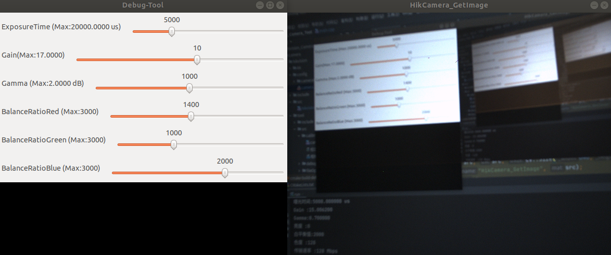

# HikRobot-HikCamera-Tool

#### 通过封装常用相机操作，让你的工业相机开箱即用！

* 本项目适用于 **海康机器人MV系列** 工业相机产品
> 建议使用以下已通过测试的型号:
>
> * MV-CA013-21UC
> 
> * MV-CA016-10UC

### 环境依赖
* 海康工业相机SDK
* OpenCV 3.5及其以上
* yaml-cpp

## 已实现的功能：
* 采集图像、数据显示、触发时间戳记录等基础功能
* 相机实时调试参数
* [相机标定与畸变矫正](camera/hikvision/tool/src/calibration/相机标定模块使用说明.md)

## TODO：
* 相机&IMU联合标定示例
* 双目相机模块示例

## 特别鸣谢
luckyluckydadada 的开源为本项目提供了思路：

https://github.com/luckyluckydadada/HIKROBOT-MVS-CAMERA-ROS

如果你有更好的想法，欢迎 Issues 和 PR ！
